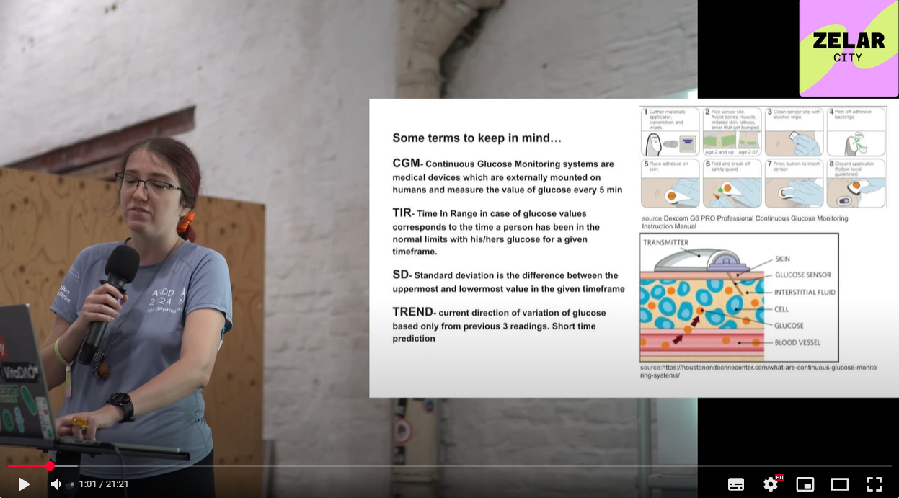

---
# https://vitepress.dev/reference/default-theme-home-page
---
# Applying Decentralized Science and Funding to the Glucose Data Issue

## Why It Matters

Recent studies have shown that glucose values are related to health and longevity, making this issue relevant to anyone interested in improving their health and lifespan, not just diabetics.
If you would rather have a more in-depth and interactive discussion about it - use the chatbot [here](https://glucosedao.org/).

### In case you prefer watching videos rather than reading, here are videos about GlucoseDAO:
GlucoseDAO project presentation:

And if you want to know more detailed information check out GlucoseDAO presentation at Zelar, Berlin:

## Glucose Values and Their Significance

Glucose levels and dynamics impact overall health and longevity, however, there are three major groups that stand out:

1. *Individuals with medical conditions*: This includes those with type I and II diabetes, pre-diabetic individuals, pregnancy diabetes, etc., comprising 460 million people worldwide.
2. *Healthy lifestyle pursuers*
3. *Longevity enthusiasts*

## A Personalized Approach

Understanding your glucose values and dynamics is about self-knowledge. Each person's glucose response is unique, and continuous monitoring of changes is more informative than single-point tests. Comprehensive study and data collection are necessary to understand how these fluctuations affect individuals and how to improve them.

- For people with diabetes, it allows maintaining normal ranges and avoiding hypo and hyperglycemia.
- For health and longevity seekers, it can help optimize diet, lifestyle, and reduce damage from glucose spikes and risks of prediabetes.

## Proposed Solution

We propose:

1. *Establish a decentralized open database of blood glucose values* from Continuous Glucose Monitoring (CGM) devices. The data will be contributed by volunteers and may also include relevant health and lifestyle-related variables (diseases, weight, height, etc.).
2. *Train models to predict blood glucose trends* and fine-tune existing public models on this data. Contribute the model and dataset to [GlucoBench benchmark](https://github.com/IrinaStatsLab/GlucoBench/).
3. *Establish a Glucose DAO (Decentralized Autonomous Organization)* which will govern data collection and development and will also work on protocols of sharing glucose data and smart contracts that will allow participants to be rewarded in case of commercial applications. For more information about GlucoseDAO you can use the chatbot [here](https://glucosedao.org/).

This approach aligns with recent research on privacy-preserved blood glucose level cross-prediction using decentralized federated learning. (https://github.com/ChengzhePiao/coldstartbglp)

## Examining the Current Use of Glucose Data

A clear need for a DAO approach is evident. This strategy addresses the prevalent issue of user data being sold without revenue sharing. A DAO structure offers two potential solutions:

### Open-source for Research

A DAO can facilitate an open-source database of anonymized glucose data, promoting transparency and collaborative research while maintaining privacy of contributors. This aligns with the decentralization principle of DAOs, ensuring no single entity has total control over the data.

### Fair profit-sharing for commercial use-cases

For commercial applications, DAO can develop smart contracts to automate profit-sharing with data contributors to ensure fair compensation.

By implementing a DAO, the glucose data ecosystem can evolve from its current centralized model to a more transparent, collaborative, and user-centric approach.

## Benefits

This project aims to democratize access to valuable health data and insights, empowering individuals to make informed decisions about their health and longevity. By supporting this project, you are not only helping people with medical conditions but also paving the way for access to information that could potentially extend or at least improve your lifespan.

<VPTeamPage>
  <VPTeamPageSection>
    <template #title>Our Team</template>
    <template #members>
      <VPTeamMembers size="small" :members="team_members" />
    </template>
  </VPTeamPageSection>
  <VPTeamPageSection>
    <template #title>Scientific Advisory Board</template>
    <template #members>
      <VPTeamMembers size="medium" :members="advisory_board" />
    </template>
  </VPTeamPageSection>
</VPTeamPage>

## Additional Information

### Problem Statement

- *Underutilized data from increasing CGM adoption*: 463 million people have diabetes worldwide and millions of them already use CGMs for many years. Existing datasets have only dozens of people monitored at short intervals of several months [Renat Sergazinov, et. al, "GlucoBench: Curated List of Continuous Glucose Monitoring Datasets with Prediction Benchmarks." OpenReview, 2023, see also https://github.com/IrinaStatsLab/Awesome-CGM). While acknowledging the endeavor of Irina Gaynanova lab of summarizing existing datasets, we believe that a novel, large longitudinal dataset must be created.
- *Most existing data are of clinical/academic nature*: While useful for research and development, most existing datasets are usually of academic/clinical nature, have short timespans, have a small number of non-diabetic people, and do not include some important aspects (like data on sensor resets, for example).
- *Existing models are hard to deploy and use in real-world scenarios and are not user-friendly*: Only a small part of the models is public and most of them are hard to deploy and use on an everyday basis for an average user. What is important for the end-user is that the model pre-trained on public datasets should be fine-tuned on your own data to predict your future values and your risks.
- *Existing data sharing platforms* (like https://www.tidepool.org/bigdata) sell users' personal information to companies without compensating the data owners. We believe users should be fairly rewarded when their data is sold for commercial purposes. One potential solution is the development of smart contracts by the Glucose DAO.

### Importance

Glucose prediction is crucial for longevity, as both levels and variations impact health. Studies show high glucose values and variations negatively affect longevity in the general population, not just diabetics. The relationship between glycation, Advanced Glycation End Products (AGEs), and health outcomes further underscores this importance.

For reference: https://www.ncbi.nlm.nih.gov/pmc/articles/PMC5643203/

### Personal Motivation
Livia Zaharia - team member and type 1 diabetic since 2001:

As a diabetic with extensive CGM data, I've recognized the need for a pattern-reading model to predict future glucose values. This project aims to bridge the gap in long-term data availability from non-diabetic individuals and provide valuable insights for glucose management and overall health optimization.

### Important links

#### Github organisation:
- [GlucoseDAO organization](https://github.com/GlucoseDAO)

#### Projects of our friends:
- [Just-DNA-Seq](https://github.com/dna-seq) -  is an open-source personal genomics platform designed to unlock the secrets of your DNA.
- [Longevity-Genie](https://github.com/longevity-genie) - is an open-source AI assistant for health, genetics, and longevity research.

